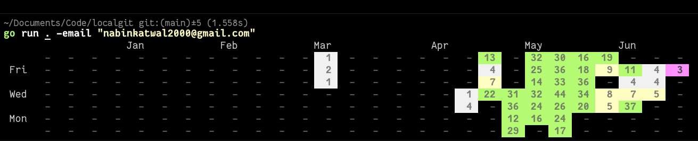

# CLI for visualizing your local git commits
## Usage
1. Clone the repository
2. install packages using `go mod tidy`
3. add folders to check using `go run main.go -add /path/to/files`
4. add your email using `go run main.go -email youremail@example.com`

### PREVIEW

